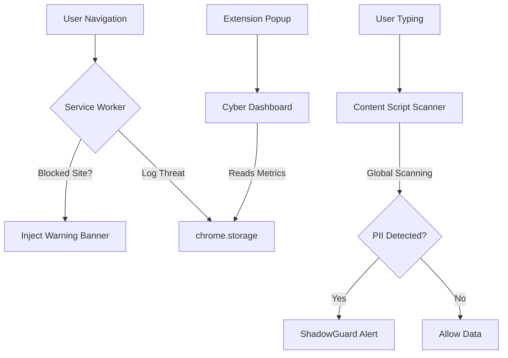

# 🛡️ ShadowGuard AI Governance
> **Enterprise-Grade AI Security, Data Leakage Prevention (DLP), and Stealth AI Monitoring.**

[](https://developer.chrome.com/docs/extensions/mv3/intro/)
[](https://vuejs.org/)
[](https://tailwindcss.com/)
[](https://opensource.org/licenses/MIT)

ShadowGuard is a sophisticated Chrome Extension designed for enterprise environments to govern the usage of "Shadow AI" tools. It provides real-time URL interception, global PII/API Key scanning, and a high-performance cybersecurity dashboard.

---

## ✨ Core Features

### 🚫 Proactive AI Governance
Automatically blocks access to unverified or high-risk AI tools based on a dynamic enterprise blocklist. 
*   **Custom Warning Banner**: Injected via Shadow DOM to ensure zero style-leakage from host sites.
*   **Real-time Interception**: Caught at the network and navigation level for maximum reliability.

### 🔍 Global Data Leakage Prevention (DLP)
The most powerful layer of ShadowGuard—monitoring every input field you interact with.
*   **PII Detection**: Identifies Emails and sensitive patterns in real-time.
*   **API Key Protection**: Detects and blocks the accidental sharing of credentials with public LLMs.
*   **Cross-Frame Scanning**: Deep-frame injection ensures that even chat boxes in `iframes` are monitored.

### 📊 Threat Intelligence Dashboard
A premium, dark-mode dashboard providing security administrators and users with full transparency.
*   **Threat Score**: Live count of blocked AI sessions.
*   **Intercept History**: Log of recently flagged domains and activities.

---

## 🏗️ Architecture & Data Flow



---

## 🛠️ Technical Stack
- **Framework**: Vue 3 (Composition API)
- **Styles**: Tailwind CSS v4 + PostCSS
- **Build System**: Vite 6 (Modern ESM Pipeline)
- **Language**: TypeScript
- **Injection Mode**: ESM Dynamic Loader with Hydration-safe timing

---

## 🚀 Getting Started

### Prerequisites
- Node.js 18+
- Chrome Browser

### Installation
1.  **Clone the Repo**:
    ```bash
    git clone https://github.com/Binary-World01/ShadowGuard.git
    cd ShadowGuard
    ```
2.  **Install Dependencies**:
    ```bash
    npm install
    ```
3.  **Build the Project**:
    ```bash
    npm run build
    ```
4.  **Load in Chrome**:
    *   Open `chrome://extensions/`
    *   Enable **Developer Mode**
    *   Click **Load unpacked** and select the `dist/` folder.

---

## 🔒 Security Philosophy
ShadowGuard treats every unverified AI prompt as a potential threat vector. By enforcing a "Zero-Trust" approach to AI input fields, we ensure that corporate intellectual property stays within the firewall.

---

> [!TIP]
> **Pro Tip**: Pin the ShadowGuard icon to your browser for real-time visibility into your local Threat Score.

Created with 🛡️ by Antigravity.
